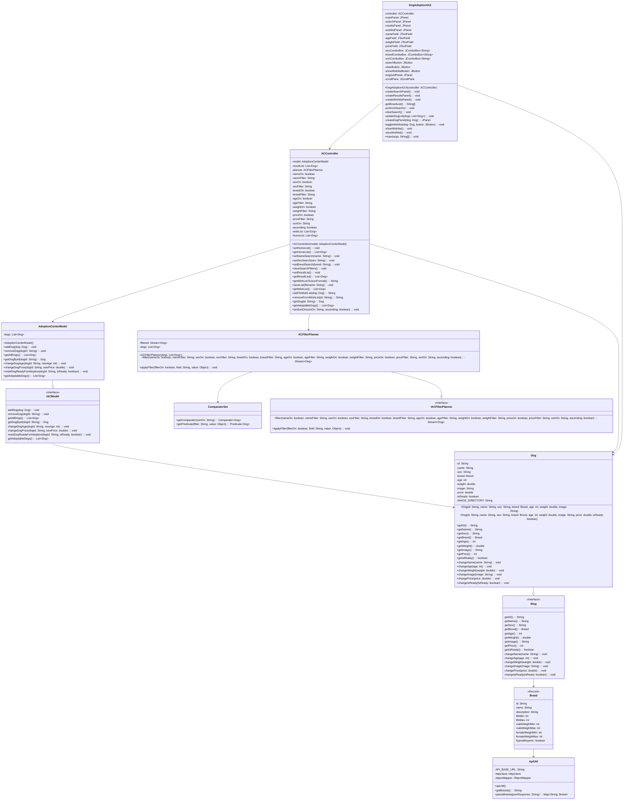

MERMAID DIAGRAM

```mermaid
classDiagram
class IDog {
    <<Interface>>
    getID(): String
    getName(): String
    getSex(): String
    getBreed(): Breed
    getAge(): int
    getWeight(): double
    getImage(): String
    getPrice(): int
    getIsReady(): boolean
    changeName(name: String): void
    changeAge(age: int): void
    changeWeight(weight: double): void
    changeImage(image: String): void
    changePrice(price: double): void
    changeIsReady(isReady: boolean): void
}
class Dog {
    -id: String
    -name: String
    -sex: String
    -breed: Breed
    -age: int
    -weight: double
    -image: String
    -price: double
    -isReady: boolean
    -IMAGE_DIRECTORY: String
    +Dog(id: String, name: String, sex: String, breed: Breed, age: int, weight: double, image: String)
    +Dog(id: String, name: String, sex: String, breed: Breed, age: int, weight: double, image: String, price: double, isReady: boolean)
    +getID(): String
    +getName(): String
    +getSex(): String
    +getBreed(): Breed
    +getAge(): int
    +getWeight(): double
    +getImage(): String
    +getPrice(): int
    +getIsReady(): boolean
    +changeName(name: String): void
    +changeAge(age: int): void
    +changeWeight(weight: double): void
    +changeImage(image: String): void
    +changePrice(price: double): void
    +changeIsReady(isReady: boolean): void
}
class Breed {
    <<Record>>
    id: String
    name: String
    description: String
    lifeMin: int
    lifeMax: int
    maleWeightMin: int
    maleWeightMax: int
    femaleWeightMin: int
    femaleWeightMax: int
    hypoallergenic: boolean
}
class ApiUtil {
    -API_BASE_URL: String
    -httpClient: HttpClient
    -objectMapper: ObjectMapper
    +apiUtil()
    +getBreeds(): String
    +parseBreeds(jsonResponse: String): Map~String, Breed~
}
class IACModel{
    <<Interface>>
    addDog(dog: Dog): void 
    removeDog(dogID: String): void
    getAllDogs(): List~Dog~
    getDogById(dogId: String): Dog
    changeDogAge(dogId: String, newAge: int): void
    changeDogPrice(dogId: String, newPrice: double): void
    markDogReadyForAdoption(dogId: String, isReady: boolean): void
    getAdoptableDogs(): List~Dog~
}
class AdoptionCenterModel {
    -dogs: List~Dog~
    +AdoptionCenterModel()
    +addDog(dog: Dog): void 
    +removeDog(dogID: String): void
    +getAllDogs(): List~Dog~
    +getDogById(dogId: String): Dog
    +changeDogAge(dogId: String, newAge: int): void
    +changeDogPrice(dogId: String, newPrice: double): void
    +markDogReadyForAdoption(dogId: String, isReady: boolean): void
    +getAdoptableDogs(): List~Dog~
}
class ComparatorSet {
    +getComparator(sortOn: String): Comparator~Dog~
    +getPredicate(filter: String, value: Object): Predicate~Dog~
}
class IACFilterPlanner {
    <<interface>>
    +filter(nameOn: boolean, nameFilter: String, sexOn: boolean, sexFilter: String, breedOn: boolean, breedFilter: String, ageOn: boolean, ageFilter: String, weightOn: boolean, weightFilter: String, priceOn: boolean, priceFilter: String, sortOn: String, ascending: boolean): Stream~Dog~
	+applyFilter(filterOn: boolean, field: String, value: Object): void
}
class ACFilterPlanner {
	-filtered: Stream~Dog~
    -dogs: List~Dog~
	+ACFilterPlanner(dogs: List~Dog~)
	+filter(nameOn: boolean, nameFilter: String, sexOn: boolean, sexFilter: String, breedOn: boolean, breedFilter: String, ageOn: boolean, ageFilter: String, weightOn: boolean, weightFilter: String, priceOn: boolean, priceFilter: String, sortOn: String, ascending: boolean): Stream~Dog~
	+applyFilter(filterOn: boolean, field: String, value: Object): void
}
class ACController {
    -model: AdoptionCenterModel
    -resultList: List~Dog~
    -planner: ACFilterPlanner
    -nameOn: boolean
    -nameFilter: String
    -sexOn: boolean
    -sexFilter: String
    -breedOn: boolean
    -breedFilter: String
    -ageOn: boolean
    -ageFilter: String
    -weightOn: boolean
    -weightFilter: String
    -priceOn: boolean
    -priceFilter: String
    -sortOn: String
    -ascending: boolean
    -wishList: List~Dog~
    -homeList: List~Dog~
    +ACController(model: AdoptionCenterModel)
    +setHomeList(): void
    +getHomeList(): List~Dog~
    +setNameSearch(name: String): void
    +setSexSearch(sex: String): void
    +setBreedSearch(breed: String): void
    +clearSearchFilters(): void
    +setResultList(): void
    +getResultList(): List~Dog~
    +getWishListToJsonFormat(): String
    +saveList(filename: String): void
    +getWishList(): List~Dog~
    +addToWishList(dog: Dog): String
    +removeFromWishList(id: String): String
    +getDog(id: String): Dog
    +getAdoptableDogs(): List~Dog~
    +setSortOn(sortOn: String, ascending: boolean): void
}
class DogAdoptionGUI {
    -controller: ACController
    -mainPanel: JPanel
    -searchPanel: JPanel
    -resultsPanel: JPanel
    -wishlistPanel: JPanel
    -nameField: JTextField
    -ageField: JTextField
    -weightField: JTextField
    -priceField: JTextField
    -sexComboBox: JComboBox~String~
    -breedComboBox: JComboBox~String~
    -sortComboBox: JComboBox~String~
    -searchButton: JButton
    -clearButton: JButton
    -showWishlistButton: JButton
    -dogGridPanel: JPanel
    -scrollPane: JScrollPane
    +DogAdoptionGUI(controller: ACController)
    -createSearchPanel(): void
    -createResultsPanel(): void
    -createWishlistPanel(): void
    -getBreedList(): String[]
    -performSearch(): void
    -clearSearch(): void
    -updateDogList(dogs: List~Dog~): void
    -createDogPanel(dog: Dog): JPanel
    -toggleWishlist(dog: Dog, button: JButton): void
    -showWishlist(): void
    -saveWishlist(): void
    +main(args: String[]): void
}
Breed --> ApiUtil
IDog --> Breed
Dog --|> IDog
IACModel --> Dog 
AdoptionCenterModel --|> IACModel
ACFilterPlanner --|> IACFilterPlanner
ACFilterPlanner --> ComparatorSet
ACController --> AdoptionCenterModel
ACController --> ACFilterPlanner
ACController --> Dog
DogAdoptionGUI --> ACController
DogAdoptionGUI --> Dog
```
